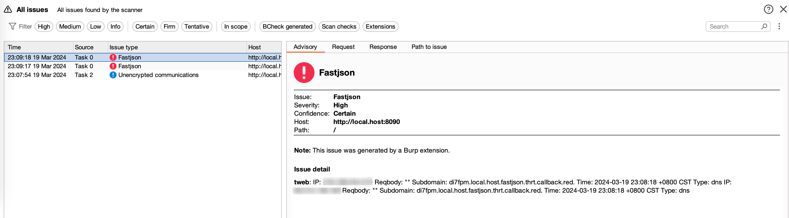

## RCEFuzzer-mod

### ToDo

- [ ] Tweb改造，实现适配dnslog平台（~~callback.red~~/dnslog.cn/ceye.io）

### 2024-03-19

- [x] Tweb改造，实现适配callback.red

### 2024-03-18

 - [x] 反编译项目，完成maven编译测试


## fastjson测试





## dnslog数据格式差异

### callback(dns、http、ldap、rmi)

#### getsubdomain + api

```http request
GET /get HTTP/1.1
Host: callback.red
Accept-Encoding: gzip, deflate, br
Accept-Language: zh-CN,zh;q=0.9
Connection: keep-alive

```

```http request
{"key":"2466752d-85cf-46c5-ba12-2469b117b870","subdomain":"burq.callback.red","rmi":"rmi://jndi.150.158.176.82:5/burq","ldap":"ldap://jndi.150.158.176.82:5/burq"}
```

#### getlog

```http request
POST / HTTP/1.1
Host: callback.red
Content-Length: 40
Content-Type: application/x-www-form-urlencoded
Connection: keep-alive

key=2466752d-85cf-46c5-ba12-2469b117b870
```

```http request
{"code":200,"data":[{"ip":"60.xxx.xxx.160","reqbody":"","subdomain":"burq.callback.red.","time":"2024-03-18 22:24:26 +0800 CST","type":"dns"},{"ip":"58.xxx.xxx.111","reqbody":{"data":"","headers":{"Accept":["*/*"],"User-Agent":["curl/8.4.0"]},"url":"/"},"subdomain":"burq.callback.red","time":"2024-03-18 22:24:26 +0800 CST","type":"http"},{"ip":"218.xxx.xxx.194","reqbody":"","subdomain":"burq.callback.red.","time":"2024-03-18 22:24:27 +0800 CST","type":"dns"}]}
```

### dnslogcn(dns)

#### getsubdomain + api

```http request
GET /getdomain.php HTTP/1.1
Host: dnslog.cn
User-Agent: Mozilla/5.0 (Macintosh; Intel Mac OS X 10_15_7) AppleWebKit/537.36 (KHTML, like Gecko) Chrome/122.0.0.0 Safari/537.36
Accept: */*
Referer: http://dnslog.cn/
Accept-Encoding: gzip, deflate, br
Accept-Language: zh-CN,zh;q=0.9
Connection: keep-alive


```

```http request
HTTP/1.1 200 OK
Set-Cookie: PHPSESSID=t6ip427ok3fdf4tfhgql6hdgi5; path=/
Connection: close
Content-Type: text/html; charset=UTF-8

ppw8iu.dnslog.cn
```

#### getlog

```http request
GET /getrecords.php HTTP/1.1
Host: dnslog.cn
Accept: */*
Referer: http://dnslog.cn/
Accept-Encoding: gzip, deflate, br
Accept-Language: zh-CN,zh;q=0.9
Cookie: PHPSESSID=t6ip427ok3fdf4tfhgql6hdgi5
Connection: keep-alive


```

```http request
HTTP/1.1 200 OK
Cache-Control: no-store, no-cache, must-revalidate, post-check=0, pre-check=0
Pragma: no-cache
Content-Length: 529
Keep-Alive: timeout=5, max=100
Connection: Keep-Alive
Content-Type: application/json; charset=utf-8

[["aaaa.ppw8iu.dnslog.cn","218.xxx.xxx.210","2024-03-18 22:20:13"],["aaaa.ppw8iu.dnslog.cn","218.xxx.xxx.206","2024-03-18 22:20:13"],["aaaa.ppw8iu.dnslog.cn",""218.xxx.xxx.206","2024-03-18 22:20:13"]]
```


### ceyeio（dns、http）

#### getlog

```http request

```


